# Adib Sunasra

### B.Tech CSE (AI & ML) · Full-Stack Developer · Systems Builder

Building systems where AI assists, but deterministic logic decides.

 

 

[GitHub](https://github.com/Adib-07) · [LinkedIn](https://linkedin.com/in/adib-sunasra)

 

---

## About

CSE student focused on AI/ML and full-stack development. I build practical systems that operate under real constraints — where security, reliability, and deterministic logic matter more than features. My work spans clinical AI safety, civic operations platforms, campus systems, and local-first assistants.

---

## What I Am Building Toward

AI systems where extraction is assisted but classification is deterministic. Full-stack applications with database-enforced security, not middleware. Systems designed for incomplete information — where `UNKNOWN` blocks action rather than silently producing a wrong answer.

Moving deeper into AI systems engineering, production-grade full-stack architecture, and security-aware design.

---

## Engineering DNA

---

## How I Think

**I treat security as a data-layer responsibility.**
Role-based access belongs in the database, not application code. The database enforces the rules. Middleware is a secondary concern.

**AI extracts. Rules decide.**
Use AI for parsing and analysis. Never for critical decisions. The final call belongs to deterministic logic that can be tested and verified.

**Missing information stays missing.**
Incomplete data blocks action. `UNKNOWN` is never converted to `false`. The system refuses to classify rather than guess.

**Every action leaves evidence.**
Photos, logs, audit trails — they exist because the system requires traceability. Workflows without evidence are workflows without accountability.

---

## Tech DNA

**LANGUAGES** · TypeScript · Python · JavaScript · C

**FRONTEND** · React · Next.js · TanStack · Tailwind CSS

**BACKEND** · FastAPI · Supabase · SQLAlchemy

**AI** · Gemini · OpenAI · Ollama

**DATA** · PostgreSQL · SQLite · Supabase RLS

**ENGINEERING** · Vitest · pytest · JWT · RBAC · PBKDF2

---

## Engineering Direction

---

## Selected Builds

### Civic-eye

Multi-tenant civic operations platform with database-enforced access control.

RLS · 4-role system · Photo evidence · GPS · SLA tracking

[Source](https://github.com/Adib-07/Civic-eye) · [Live Demo](https://civic-eye-alpha.vercel.app)

---

### IMNCI-Safe

AI-assisted clinical classification with deterministic safety rules.

Gemini extraction · Human verification · Deterministic rules · UNKNOWN invariant · 245 tests

[Source](https://github.com/Adib-07/IMNCI-Safe)

---

### CIRCUVA

Campus operations system with custom SVG rendering.

FastAPI · JWT/RBAC · Custom SVG maps · Closed-loop verification · 66 tests

[Source](https://github.com/Adib-07/CIRCUVA)

---

### Jervis

Personal AI assistant with voice interaction and local-first architecture.

Voice/text input · Local LLM · SQLite memory · macOS integration · No cloud dependency

[Source](https://github.com/Adib-07/Jervis)

---

 

**BUILD · LEARN · IMPROVE**

