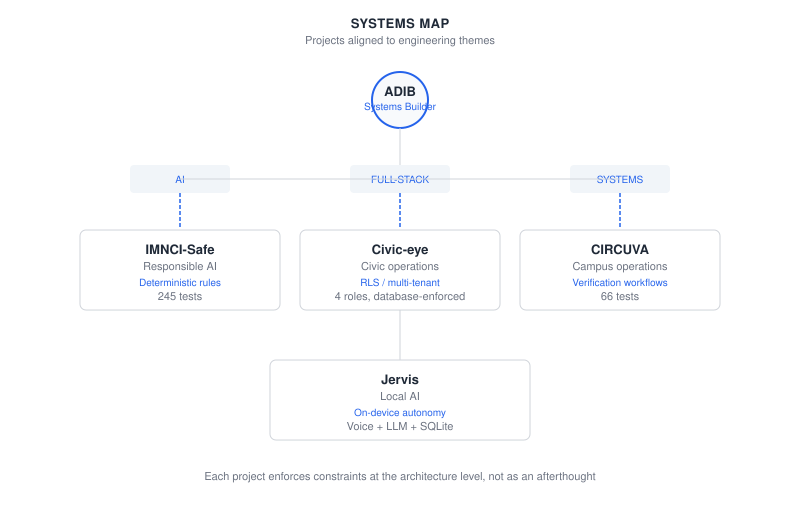

# Adib Sunasra

### Full-Stack Developer · Systems Builder

Building software systems under real constraints —
where AI, security, deterministic logic, and human workflows meet.

 

[WORK](#selected-work) · [SYSTEMS](#systems-map) · [ENGINEERING](#engineering-principles) · [STACK](#stack)

 

---

## Systems Map

---

## Selected Work

### 01 / Civic-eye — Civic Operations

Multi-tenant civic issue platform with database-enforced access control and SLA tracking.

- Supabase RLS — all access control enforced at the database layer
- 4-role system: citizen, ward_officer, admin, super_admin
- Photo evidence, GPS, before/after resolution comparison
- No custom backend server — frontend reads directly via Supabase SDK

`React 19` · `TanStack Start` · `Supabase` · `Leaflet` · `TypeScript`

[**Live Demo**](https://civic-eye-alpha.vercel.app) · [**Source**](https://github.com/Adib-07/Civic-eye)

---

### 02 / IMNCI-Safe — Responsible AI

Clinical decision support combining LLM extraction with deterministic safety rules.

- Three-layer architecture: Gemini extracts → human verifies → rules decide
- `UNKNOWN` is never converted to `false` — missing data blocks classification
- Regex fallback when Gemini API is unavailable
- 245 automated tests across rules engine, safety boundaries, and extraction

`Next.js 16` · `Gemini` · `Vitest` · `TypeScript` · `Tailwind CSS`

[**Live Demo**](https://imnci-safe.vercel.app) · [**Source**](https://github.com/Adib-07/IMNCI-Safe)

---

### 03 / CIRCUVA — Campus Operations

Campus issue reporting with a closed-loop verification workflow and custom SVG rendering.

- Report → dispatch → resolve → verify pipeline with enforced status transitions
- Custom SVG campus map and analytics charts — zero external charting libraries
- JWT/RBAC with PBKDF2-SHA256 and role-based access control
- 66 automated tests covering security, API, and workflow paths

`FastAPI` · `SQLAlchemy` · `JWT/RBAC` · `Python` · `SQLite`

[**Source**](https://github.com/Adib-07/CIRCUVA)

---

### 04 / Jervis — Local AI

Modular personal AI assistant with voice interaction and local LLM support.

- Text, voice, or web input routed through command handler
- On-device by default — SQLite memory, macOS integration, no cloud dependency
- Dual LLM backend: OpenAI when configured, Ollama as fallback
- Local web UI with conversation log, quick actions, microphone input

`Python` · `OpenAI/Ollama` · `SQLite` · `pyttsx3`

[**Source**](https://github.com/Adib-07/Jervis)

---

## Engineering Principles

---

## Proof

| **311** | **DATABASE-ENFORCED** | **UNKNOWN ≠ false** | **JWT / RBAC** | **CUSTOM SVG** | **LOCAL-FIRST** |
|:---:|:---:|:---:|:---:|:---:|:---:|
| AUTOMATED TESTS | RLS policies | SAFETY INVARIANT | ACCESS CONTROL | CAMPUS MAP | AI ARCHITECTURE |
| 245 IMNCI-Safe + 66 CIRCUVA | Civic-eye | IMNCI-Safe | CIRCUVA | CIRCUVA | Jervis |

---

## Stack

**LANGUAGES**
TypeScript · Python · JavaScript

**APPLICATIONS**
React · Next.js · TanStack · FastAPI

**DATA**
Supabase · PostgreSQL · SQLite · SQLAlchemy

**AI**
Gemini · OpenAI · Ollama

**ENGINEERING**
Vitest · pytest · RLS · RBAC · JWT · PBKDF2

---

## How I Think

**AI assists. Rules decide.**

**Security belongs at the data layer.**

**Incomplete information should remain incomplete.**

**Evidence should survive the workflow.**

---

